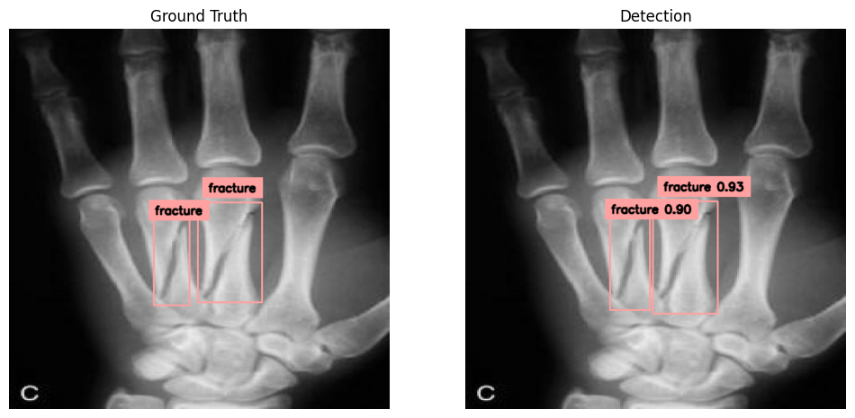

# Bone Fracture Detection using DETR

An **end-to-end object detection system** using **DETR (facebook/detr-resnet-50)** to detect and annotate **bone fractures** from medical X-ray images. The project leverages PyTorch Lightning, Hugging Face Transformers, and Supervision for dataset preprocessing, model training, and high-precision inference.

---

## 🚀 Features

- Fine-tunes **DETR** on a custom COCO-formatted dataset of **~1,200 images**.
- Detects and annotates **5 classes of bone fractures**.
- Implements **custom dataloaders** and preprocessing using Roboflow and COCO annotations.
- Optimized training with:
  - Backbone-specific learning rates
  - Gradient accumulation
  - Mixed-precision training
- Visualizes predictions side-by-side with ground truth annotations.
- End-to-end pipeline from dataset preprocessing → model training → inference → visualization.

---

--

## 🛠 Tools & Libraries

**Tools:** Python, PyTorch, PyTorch Lightning, Hugging Face Transformers, Supervision, OpenCV, Roboflow, COCO Dataset, Matplotlib, Git, Google Colab, Jupyter Notebook

---

## 📈 Results

- High-precision detection of **5 fracture classes**.  
- Visual validation demonstrates accurate bounding box predictions across diverse X-ray images.  
- Efficient inference leveraging **PyTorch Lightning** and **mixed-precision training**.

## ✨ Acknowledgements

- [DETR: End-to-End Object Detection with Transformers](https://github.com/facebookresearch/detr)  
- [Hugging Face Transformers](https://huggingface.co/transformers/)  
- [Roboflow](https://roboflow.com/)  
- [Supervision Library](https://github.com/roboflow/supervision)  
